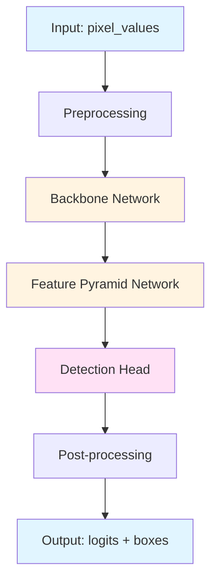
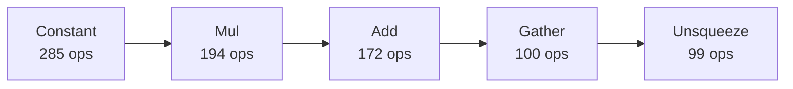

# Architecture: multilingual-e5-small (QDQ)

**Documented:** 2025-10-12 23:37:26

## Model Overview

## Architecture Diagram

### Operator Flow (Top 5 Operations)

### Metadata

- **Ir Version:** 6
- **Producer Name:** onnx.quantize
- **Producer Version:** 0.1.0

### File Information

- **File Size:** 112.83 MB
- **Precision:** QDQ

## Input/Output Specification

### Inputs

| Name | Type | Shape |
|------|------|-------|
| `input_ids` | int64 | ('batch_size', 'sequence_length') |
| `attention_mask` | int64 | ('batch_size', 'sequence_length') |
| `token_type_ids` | int64 | ('batch_size', 'sequence_length') |

### Outputs

| Name | Type | Shape |
|------|------|-------|
| `last_hidden_state` | float32 | ('batch_size', 'sequence_length', 384) |

## Graph Structure

- **Nodes:** 1511
- **Inputs:** 3
- **Outputs:** 1
- **Initializers:** 347
- **Graph Depth:** 32

## Operators

**Total Operations:** 1511

### Operator Frequency

| Operator | Count | Percentage |
|----------|-------|------------|
| `Constant` | 285 | 18.9% |
| `Mul` | 194 | 12.8% |
| `Add` | 172 | 11.4% |
| `Gather` | 100 | 6.6% |
| `Unsqueeze` | 99 | 6.6% |
| `Shape` | 97 | 6.4% |
| `Cast` | 73 | 4.8% |
| `MatMulInteger` | 72 | 4.8% |
| `ReduceMean` | 50 | 3.3% |
| `Div` | 49 | 3.2% |
| `DynamicQuantizeLinear` | 48 | 3.2% |
| `Concat` | 48 | 3.2% |
| `Reshape` | 48 | 3.2% |
| `Transpose` | 48 | 3.2% |
| `Sub` | 26 | 1.7% |
| `Pow` | 25 | 1.7% |
| `Sqrt` | 25 | 1.7% |
| `MatMul` | 24 | 1.6% |
| `Softmax` | 12 | 0.8% |
| `Erf` | 12 | 0.8% |
| `DequantizeLinear` | 3 | 0.2% |
| `Slice` | 1 | 0.1% |

**Total Operator Types:** 22

## Parameters

- **Total Parameters:** 117,588,870
- **Total Size:** 112.43 MB
- **Number of Tensors:** 347

---

*Auto-generated architecture documentation*
