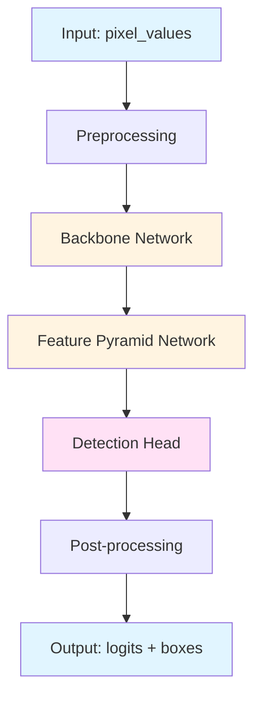
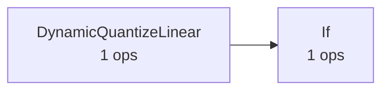

# Architecture: whisper-tiny (QDQ)

**Documented:** 2025-10-12 21:11:30

## Model Overview

## Architecture Diagram

### Operator Flow (Top 5 Operations)

### Metadata

- **Ir Version:** 8
- **Producer Name:** onnx.quantize
- **Producer Version:** 0.1.0

### File Information

- **File Size:** 29.3 MB
- **Precision:** QDQ

## Input/Output Specification

### Inputs

| Name | Type | Shape |
|------|------|-------|
| `input_ids` | int64 | ('batch_size', 'decoder_sequence_length') |
| `encoder_hidden_states` | float32 | ('batch_size', 'encoder_sequence_length / 2', 384) |
| `past_key_values.0.decoder.key` | float32 | ('batch_size', 6, 'past_decoder_sequence_length', 64) |
| `past_key_values.0.decoder.value` | float32 | ('batch_size', 6, 'past_decoder_sequence_length', 64) |
| `past_key_values.0.encoder.key` | float32 | ('batch_size', 6, 'encoder_sequence_length_out', 64) |
| `past_key_values.0.encoder.value` | float32 | ('batch_size', 6, 'encoder_sequence_length_out', 64) |
| `past_key_values.1.decoder.key` | float32 | ('batch_size', 6, 'past_decoder_sequence_length', 64) |
| `past_key_values.1.decoder.value` | float32 | ('batch_size', 6, 'past_decoder_sequence_length', 64) |
| `past_key_values.1.encoder.key` | float32 | ('batch_size', 6, 'encoder_sequence_length_out', 64) |
| `past_key_values.1.encoder.value` | float32 | ('batch_size', 6, 'encoder_sequence_length_out', 64) |
| `past_key_values.2.decoder.key` | float32 | ('batch_size', 6, 'past_decoder_sequence_length', 64) |
| `past_key_values.2.decoder.value` | float32 | ('batch_size', 6, 'past_decoder_sequence_length', 64) |
| `past_key_values.2.encoder.key` | float32 | ('batch_size', 6, 'encoder_sequence_length_out', 64) |
| `past_key_values.2.encoder.value` | float32 | ('batch_size', 6, 'encoder_sequence_length_out', 64) |
| `past_key_values.3.decoder.key` | float32 | ('batch_size', 6, 'past_decoder_sequence_length', 64) |
| `past_key_values.3.decoder.value` | float32 | ('batch_size', 6, 'past_decoder_sequence_length', 64) |
| `past_key_values.3.encoder.key` | float32 | ('batch_size', 6, 'encoder_sequence_length_out', 64) |
| `past_key_values.3.encoder.value` | float32 | ('batch_size', 6, 'encoder_sequence_length_out', 64) |
| `use_cache_branch` | bool | (1) |

### Outputs

| Name | Type | Shape |
|------|------|-------|
| `logits` | float32 | ('batch_size', 'decoder_sequence_length', 51865) |
| `present.0.decoder.key` | float32 | ('batch_size', 6, 'past_decoder_sequence_length + 1', 64) |
| `present.0.decoder.value` | float32 | ('batch_size', 6, 'past_decoder_sequence_length + 1', 64) |
| `present.0.encoder.key` | float32 | ('batch_size', 6, 'encoder_sequence_length_out', 64) |
| `present.0.encoder.value` | float32 | ('batch_size', 6, 'encoder_sequence_length_out', 64) |
| `present.1.decoder.key` | float32 | ('batch_size', 6, 'past_decoder_sequence_length + 1', 64) |
| `present.1.decoder.value` | float32 | ('batch_size', 6, 'past_decoder_sequence_length + 1', 64) |
| `present.1.encoder.key` | float32 | ('batch_size', 6, 'encoder_sequence_length_out', 64) |
| `present.1.encoder.value` | float32 | ('batch_size', 6, 'encoder_sequence_length_out', 64) |
| `present.2.decoder.key` | float32 | ('batch_size', 6, 'past_decoder_sequence_length + 1', 64) |
| `present.2.decoder.value` | float32 | ('batch_size', 6, 'past_decoder_sequence_length + 1', 64) |
| `present.2.encoder.key` | float32 | ('batch_size', 6, 'encoder_sequence_length_out', 64) |
| `present.2.encoder.value` | float32 | ('batch_size', 6, 'encoder_sequence_length_out', 64) |
| `present.3.decoder.key` | float32 | ('batch_size', 6, 'past_decoder_sequence_length + 1', 64) |
| `present.3.decoder.value` | float32 | ('batch_size', 6, 'past_decoder_sequence_length + 1', 64) |
| `present.3.encoder.key` | float32 | ('batch_size', 6, 'encoder_sequence_length_out', 64) |
| `present.3.encoder.value` | float32 | ('batch_size', 6, 'encoder_sequence_length_out', 64) |
| `decoder_attentions.0` | float32 | ('batch_size', 6, 'decoder_sequence_length', 'past_decoder_sequence_length + 1') |
| `decoder_attentions.1` | float32 | ('batch_size', 6, 'decoder_sequence_length', 'past_decoder_sequence_length + 1') |
| `decoder_attentions.2` | float32 | ('batch_size', 6, 'decoder_sequence_length', 'past_decoder_sequence_length + 1') |
| `decoder_attentions.3` | float32 | ('batch_size', 6, 'decoder_sequence_length', 'past_decoder_sequence_length + 1') |
| `cross_attentions.0` | float32 | ('batch_size', 6, 'decoder_sequence_length', 'encoder_sequence_length_out') |
| `cross_attentions.1` | float32 | ('batch_size', 6, 'decoder_sequence_length', 'encoder_sequence_length_out') |
| `cross_attentions.2` | float32 | ('batch_size', 6, 'decoder_sequence_length', 'encoder_sequence_length_out') |
| `cross_attentions.3` | float32 | ('batch_size', 6, 'decoder_sequence_length', 'encoder_sequence_length_out') |

## Graph Structure

- **Nodes:** 2
- **Inputs:** 19
- **Outputs:** 25
- **Initializers:** 182
- **Graph Depth:** 1

## Operators

**Total Operations:** 2

### Operator Frequency

| Operator | Count | Percentage |
|----------|-------|------------|
| `DynamicQuantizeLinear` | 1 | 50.0% |
| `If` | 1 | 50.0% |

**Total Operator Types:** 2

## Parameters

- **Total Parameters:** 29,552,338
- **Total Size:** 28.75 MB
- **Number of Tensors:** 182

---

*Auto-generated architecture documentation*
