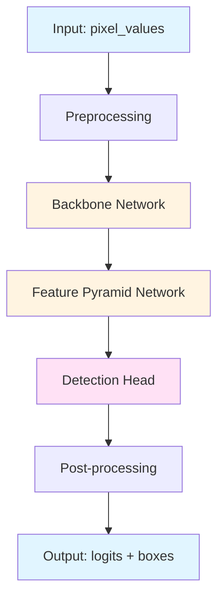
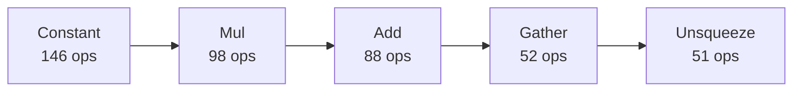

# Architecture: all-minilm-l6-v2 (QDQ)

**Documented:** 2025-10-12 23:47:20

## Model Overview

## Architecture Diagram

### Operator Flow (Top 5 Operations)

### Metadata

- **Ir Version:** 6
- **Producer Name:** onnx.quantize
- **Producer Version:** 0.1.0

### File Information

- **File Size:** 21.91 MB
- **Precision:** QDQ

## Input/Output Specification

### Inputs

| Name | Type | Shape |
|------|------|-------|
| `input_ids` | int64 | ('batch_size', 'sequence_length') |
| `attention_mask` | int64 | ('batch_size', 'sequence_length') |
| `token_type_ids` | int64 | ('batch_size', 'sequence_length') |

### Outputs

| Name | Type | Shape |
|------|------|-------|
| `last_hidden_state` | float32 | ('batch_size', 'sequence_length', 384) |

## Graph Structure

- **Nodes:** 772
- **Inputs:** 3
- **Outputs:** 1
- **Initializers:** 180
- **Graph Depth:** 32

## Operators

**Total Operations:** 772

### Operator Frequency

| Operator | Count | Percentage |
|----------|-------|------------|
| `Constant` | 146 | 18.9% |
| `Mul` | 98 | 12.7% |
| `Add` | 88 | 11.4% |
| `Gather` | 52 | 6.7% |
| `Unsqueeze` | 51 | 6.6% |
| `Shape` | 49 | 6.3% |
| `Cast` | 37 | 4.8% |
| `MatMulInteger` | 36 | 4.7% |
| `ReduceMean` | 26 | 3.4% |
| `Div` | 25 | 3.2% |
| `DynamicQuantizeLinear` | 24 | 3.1% |
| `Concat` | 24 | 3.1% |
| `Reshape` | 24 | 3.1% |
| `Transpose` | 24 | 3.1% |
| `Sub` | 14 | 1.8% |
| `Pow` | 13 | 1.7% |
| `Sqrt` | 13 | 1.7% |
| `MatMul` | 12 | 1.6% |
| `Softmax` | 6 | 0.8% |
| `Erf` | 6 | 0.8% |
| `DequantizeLinear` | 3 | 0.4% |
| `Slice` | 1 | 0.1% |

**Total Operator Types:** 22

## Parameters

- **Total Parameters:** 22,607,366
- **Total Size:** 21.71 MB
- **Number of Tensors:** 180

---

*Auto-generated architecture documentation*
